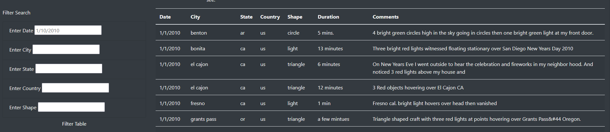
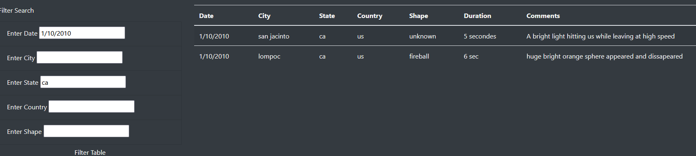

# UFO Analysis

  

## Overview of the Analysis

  

### Purpose
The purpose of this analysis is to provide a more in-depth analysis of UFO sightings by allowing users to filter for multiple criteria at the same time.
  

## Results

There are five total filter options for the UFO sightings table: date, city, state, country, and shape. An overview can be seen below.
   

These filters can be used one at a time or all together. Simply input the filter in the appropriate box and either click the "Filter Table" button or elsewhere on the page. 

## Summary
While having these additional filters is wholeheartedly better than just having a date filter, there's still room for improvement. As it stands, there's no way to know if the date you inputted is the the wrong format or if the date simply has no results in the table. It would be a good idea to verify if the inputted 'date' is in fact a date and if it's not, provide some sort of feedback to the user. Also, it would be nice if the order of the rows could be sorted based on the column. Allowing the user to click the column name to sort ascending/descending would be a huge quality of life improvement
